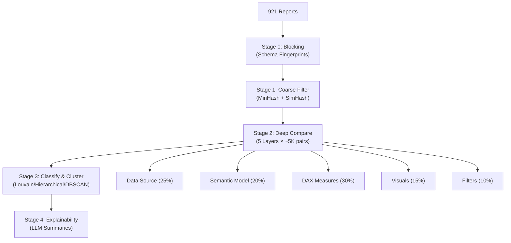
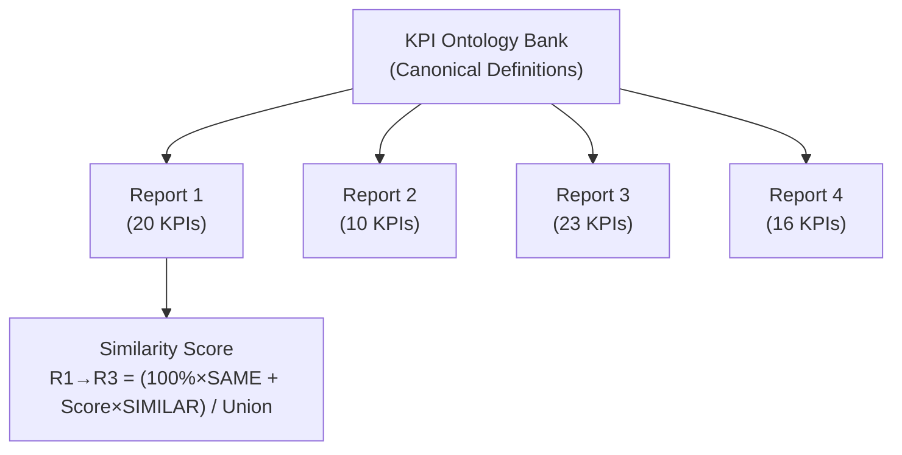

# Current Spec vs. Ontology Bank Approach — Deep Comparison

## Executive Summary

After reading all four versions of the spec ([spec.md](file:///c:/Users/madhu/Desktop/pbi-r/spec.md), [v3.md](file:///c:/Users/madhu/Desktop/pbi-r/v3.md), [v2.md](file:///c:/Users/madhu/Desktop/pbi-r/v2.md), [v1.md](file:///c:/Users/madhu/Desktop/pbi-r/v1.md)), the current approach and the ontology approach are **not conflicting alternatives — the ontology approach is a natural evolution that layers on top of the current spec's infrastructure**. Here's the full breakdown.

---

## How the Current Spec Works (Pairwise Comparison Engine)

The current spec is a **pairwise, bottom-up comparison engine**. It answers: *"How similar are Report A and Report B?"*



### Key Characteristics
| Aspect | Current Spec |
|---|---|
| **Unit of comparison** | Report vs. Report (pairwise) |
| **KPI identity** | Implicit — inferred from DAX signature/AST/LLM matching |
| **Similarity metric** | Weighted composite across 5 metadata layers |
| **Source of truth** | None — no canonical KPI definitions exist |
| **Scale math** | N(N-1)/2 pairs, reduced via blocking + LSH |
| **Output** | Clone/Near-Clone/Overlap/Unrelated + Decommission/Merge/Keep |

---

## How the Ontology Approach Works (Centralized KPI Bank)

The ontology approach is a **hub-and-spoke, top-down normalization engine**. It answers: *"What business questions does each report answer, and which reports answer the same questions?"*



### Key Characteristics
| Aspect | Ontology Approach |
|---|---|
| **Unit of comparison** | KPI vs. Canonical Ontology Entry |
| **KPI identity** | Explicit — each KPI is mapped to a known canonical definition |
| **Similarity metric** | `(100% × SAME + Σ(score × SIMILAR)) / Union` |
| **Source of truth** | The Ontology Bank IS the ground truth |
| **Scale math** | N reports × K KPIs per report = N×K LLM calls (linear, not quadratic) |
| **Output** | Per-KPI mapping confidence + Report-level overlap |

---

## Side-by-Side: Where They Agree and Differ

### ✅ Where They Naturally Align

| Capability | Current Spec | Ontology Approach | Verdict |
|---|---|---|---|
| DAX lineage to deepest level | AST parser traces `table.column` refs ([spec.md L107-175](file:///c:/Users/madhu/Desktop/pbi-r/spec.md#L107-L175)) | AST parser traces `C = D+K+V+L` | **Same infrastructure** — the spec's AST parser is exactly what the ontology approach needs |
| LLM for semantic judgment | Used for DAX ambiguity zone 50-90% ([spec.md L211-244](file:///c:/Users/madhu/Desktop/pbi-r/spec.md#L211-L244)) | Used for KPI-to-ontology mapping | **Same LLM pipeline** — different prompt, same infra |
| Confidence scoring | LLM returns `confidence: float` ([spec.md L236-240](file:///c:/Users/madhu/Desktop/pbi-r/spec.md#L236-L240)) | Ontology returns confidence score + rationale | **Same structure** |
| Human-in-the-loop | `'review'` classification with `review_reason` ([spec.md L894-898](file:///c:/Users/madhu/Desktop/pbi-r/spec.md#L894-L898)) | "Human Input = Yes" for low confidence KPIs | **Same workflow** |
| Clustering | Louvain/Hierarchical/DBSCAN on similarity graph ([spec.md L609-636](file:///c:/Users/madhu/Desktop/pbi-r/spec.md#L609-L636)) | Hierarchical clustering of report overlaps | **Same output goal** |

### ⚠️ Where They Fundamentally Differ

| Dimension | Current Spec | Ontology Approach | Impact |
|---|---|---|---|
| **Ground truth** | No canonical definitions. Similarity is relative ("A looks like B") | Ontology Bank is the canonical reference | Ontology adds a **knowledge backbone** the spec currently lacks |
| **Scale complexity** | O(N²) pairwise — mitigated by blocking/LSH but still quadratic | O(N×K) — each report mapped independently to ontology, then compared via mapped KPIs | **Ontology is dramatically cheaper at scale** |
| **KPI reusability** | Each comparison re-discovers equivalence from scratch | Once a KPI is mapped to ontology, it's mapped forever | **Ontology avoids redundant LLM work** |
| **New report onboarding** | Must compare against all existing reports | Map its KPIs to ontology once → similarity to all reports is instantly derivable | **Ontology makes incremental updates trivial** |
| **Similarity formula** | Weighted composite of 5 structural layers | `(100% × SAME + score × SIMILAR) / Union(KPIs)` — purely semantic | **Different scoring philosophy** |

---

## Critical Analysis: Does the Ontology Approach Work Better?

### 🟢 What the Ontology Adds That the Current Spec Lacks

1. **A reusable knowledge asset.** The current spec computes pairwise scores and throws away the "why" — it knows Report A's `Revenue` is 92% similar to Report B's `Total Revenue`, but this knowledge is locked in the `measure_equivalences` table for that specific pair. The ontology says: "Both of these ARE canonical KPI #17: Net Revenue" — and that mapping is reusable across ALL 921 reports.

2. **Linear scaling for comparisons.** The spec's §11 estimates 1.5-4 hours for 921 reports. With 961+ dashboards, the O(N²) pairwise approach (even with blocking) becomes the bottleneck. The ontology approach is O(N×K) where K is KPIs per report — each report is mapped to the ontology independently, and report-to-report similarity is a simple set intersection on the mapped ontology IDs. No pairwise deep comparison needed.

3. **Incremental updates are trivial.** The spec's §13 incremental design ([spec.md L1673-1801](file:///c:/Users/madhu/Desktop/pbi-r/spec.md#L1673-L1801)) is complex — it must recompute fingerprints, re-run blocking, deep-compare new candidate pairs, and invalidate affected clusters. With the ontology, a new report just maps its KPIs to the bank (K LLM calls), and its similarity to every other report is instantly derivable from the mapped ontology IDs.

4. **"Not Found" KPIs become discoverable.** The spec has no mechanism to identify genuinely new business metrics. The ontology's "NF" (Not Found) + human-validated promotion workflow creates a living catalog of the organization's analytical vocabulary.

### 🔴 What the Ontology Approach Loses

1. **Structural fidelity.** The current spec's 5-layer comparison (data source, semantic model, DAX, visuals, filters) captures structural similarity that the ontology ignores. Two reports might map to the exact same ontology KPIs but use completely different data sources, visual types, or filter configurations. The ontology score would say "100% overlap" but the spec would correctly flag data source or filter divergence.

2. **Cold-start problem.** The ontology bank must be populated before any comparison can happen. Who defines the initial canonical KPIs? The spec starts from zero and discovers relationships. The ontology requires upfront curation or a bootstrap phase.

3. **Governance layer blindness.** The ontology doesn't capture RLS conflicts, refresh mismatches, gateway differences, or permission divergence ([spec.md L350-358](file:///c:/Users/madhu/Desktop/pbi-r/spec.md#L350-L358)). These are critical for safe decommissioning.

4. **Subsumption detection gaps.** The spec's directional subsumption logic ([spec.md L388-460](file:///c:/Users/madhu/Desktop/pbi-r/spec.md#L388-L460)) uses per-layer containment scores. The ontology's KPI-level overlap doesn't capture visual subsumption or filter subsumption — a report could have all the same KPIs but present them with completely different drill-through/filter/visual configurations.

---

## Recommended Hybrid Architecture

> [!IMPORTANT]
> **The ontology approach should be integrated INTO the current spec as an additional layer — not replace it.**

The ideal architecture uses the ontology as a **6th comparison layer** (or replaces/augments the DAX layer) while keeping the structural layers intact:

```
composite = (0.15 × data_source_score) 
          + (0.15 × semantic_model_score) 
          + (0.35 × ontology_kpi_score)     ← NEW: replaces/augments DAX weight
          + (0.10 × dax_structural_score)    ← REDUCED: kept for structural edge cases
          + (0.15 × visual_score) 
          + (0.10 × filter_score)
```

### How It Would Work

1. **Bootstrap the Ontology Bank** from the current spec's `measure_equivalences` table — the pairwise matching data from the first full run seeds the canonical KPI definitions.
2. **Map each report's KPIs to the bank** using the LLM router model (Flash for extraction, Pro for reconciliation) — this is the ontology layer.
3. **Keep the structural layers** (data source, semantic model, visuals, filters, governance flags) for safe decommissioning decisions.
4. **Use the ontology score** as the primary similarity signal (replacing the DAX layer's 30% weight with a combined 35% ontology + 10% structural DAX).
5. **Incremental updates** use the ontology path (map new report's KPIs → done) instead of the complex §13 recomputation.

### What Changes in the Spec

| Section | Change |
|---|---|
| §3.3 DAX Layer | Split into "Ontology Mapping" (35%) and "DAX Structural" (10%) |
| §4.1 TF-IDF | Move to the Ontology Bank — IDF is computed against the bank, not the corpus |
| §6.1 Composite | Reweight to include ontology score |
| §9.1 Schema | Add `ontology_kpis` table, `report_kpi_mappings` table |
| §12 Pseudocode | Add ontology mapping phase between Stage 1 and Stage 2 |
| §13 Incremental | Simplify dramatically — ontology mapping is the primary incremental path |

## Open Questions

> [!IMPORTANT]
> 1. **Bootstrap strategy:** Should we run the current spec's full pairwise engine FIRST to seed the ontology bank from discovered equivalences, or build the ontology bank from scratch using domain expert input?
> 2. **Weight calibration:** The proposed 35% ontology weight is a guess. Should we run calibration (§8) with both the current and hybrid approaches on the same labeled sample to determine optimal weights?
> 3. **Ontology governance:** Who owns the ontology bank? Is it auto-maintained (LLM promotes validated KPIs), or does it require a human curator/steward?
> 4. **Scope for V1:** Should V1 be the current spec (pairwise engine) with ontology planned for V2, or should we build the hybrid from the start?

## Verification Plan

### Automated Tests
- Run the existing spec's pairwise engine on the calibration sample (200+ pairs)
- Run the ontology mapping on the same reports and compute ontology-based similarity
- Compare precision/recall of both approaches against human labels

### Manual Verification
- Domain experts review the auto-generated ontology bank for correctness
- Validate that the hybrid score produces better recommendations than either approach alone
